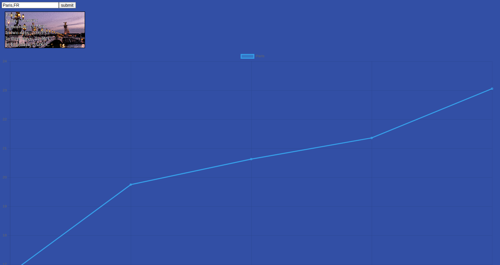

# Weather app

Un site web qui permet d'afficher la température pour les 5 prochains jours dans les villes spécifiées

## Authors

- [Sylvain Jacobs](https://www.github.com/alphit7)

## API Reference

For the weather: 

- [5 day weather forecast](https://api.openweathermap.org/data/2.5/forecast?)

For the localisation:

- [Geocoding](http://api.openweathermap.org/geo/1.0/direct?)
- [API Ninja](https://api.api-ninjas.com/v1/city?)

For the pictures: 

- [API unsplash](https://api.unsplash.com/search/photos?)

## Screenshots

## Github Page
https://alphit7.github.io/weather-app/

